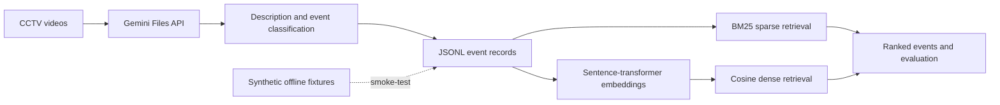

# Cerberus

Cerberus is a research-oriented toolkit for describing, classifying, searching,
and evaluating events in CCTV footage. It was developed as a University of
Toronto Engineering Science capstone project by Paul Yan, Juho Kim, Minchan
Kim, and Jacky Kuang.

> **Project status:** Cerberus is an academic prototype, not a production
> security, safety, or identity system. Review the privacy and reliability
> limitations before using real footage.

## What it does

Cerberus combines a cloud video-understanding stage with two local retrieval
methods:

- Gemini generates a description and independent binary event labels for each
  uploaded video.
- Sparse retrieval ranks descriptions with an in-memory BM25 implementation.
- Dense retrieval ranks sentence-transformer embeddings by cosine distance.
- Evaluation utilities report per-class confusion counts and retrieval metrics.



## Offline quick start

The fastest demonstration is deterministic, requires no API key, does not
download a model, and uses no real video:

```bash
git clone https://github.com/paulyan678/cerberus.git
cd cerberus
python scripts/demo.py
```

The demo runs sparse and dense ranking over six fictional, post-analysis event
records, evaluates three queries, validates classification confusion counts,
and finishes with a `PASS` line. Dense demo vectors are small hand-authored
fixtures; they are **not** outputs from the configured embedding model. This is
a smoke test of retrieval and evaluation, not evidence of video-model quality
or research performance. See [examples/README.md](examples/README.md).

Installed environments can run the same demonstration with `cerberus-demo`.

## Installation

Cerberus requires Python 3.10 or newer.

```bash
python -m venv .venv
source .venv/bin/activate
python -m pip install --upgrade pip
python -m pip install -e '.[dev]'
cp .env.example .env
```

The `dev` extra includes testing, linting, documentation, and dense-retrieval
dependencies. For a smaller installation, use `pip install -e .` for the
Gemini pipeline or `pip install -e '.[retrieval]'` to add dense retrieval.

Set `GEMINI_API_KEY` in `.env` before running cloud-backed commands. Do not
commit `.env`, API keys, or private footage.

```dotenv
GEMINI_API_KEY=replace-with-your-key
GEMINI_MODEL=gemini-3.5-flash
EMBEDDING_MODEL=sentence-transformers/multi-qa-mpnet-base-cos-v1
```

`GEMINI_MODEL` is configurable because model availability can vary by account
and date. Confirm that the selected model supports the required video inputs.

## Full video workflow

Run these commands from the repository root. The installed `cerberus-*`
commands are the primary interface; the original scripts remain as compatible
wrappers.

1. Upload selected videos. This sends the matched files to the configured
   Gemini service.

   ```bash
   cerberus-upload 'data/**/*.mp4' 'data/**/*.mov' \
     > data/video-files.jsonl
   # Legacy equivalent: python scripts/upload.py ...
   ```

2. Describe and classify the uploaded files.

   ```bash
   cerberus-describe \
     'Home Access' 'Vehicle Moving' 'Break-in' 'Package Delivery' \
     'Animal Moving' 'People Walking' 'Porch Piracy' \
     < data/video-files.jsonl \
     > data/video-events.jsonl
   ```

3. Search descriptions with dependency-free sparse retrieval.

   ```bash
   cerberus-search-sparse 3 'package delivery' 'animal in driveway' \
     < data/video-events.jsonl
   ```

4. Generate embeddings and run dense retrieval. The first invocation may
   download the configured sentence-transformer model.

   ```bash
   cerberus-embed \
     < data/video-events.jsonl \
     > data/video-event-embeddings.jsonl

   cerberus-search-dense 3 'package delivery' 'animal in driveway' \
     < data/video-event-embeddings.jsonl
   ```

5. Evaluate retrieval against reviewer-created ground truth.

   ```bash
   cerberus-evaluate-ir \
     --queries 'package delivery' 'animal in driveway' \
     --embeddings-file data/video-event-embeddings.jsonl \
     --ground-truth-file data/ground-truth.json \
     --return-k 20 \
     --top-k 5 \
     --method dense
   ```

6. Compare predicted labels with a separately prepared annotation file.

   ```bash
   cerberus-confusion \
     data/video-golden-outputs.jsonl \
     data/video-events.jsonl \
     > data/video-confusion.jsonl
   ```

7. Inspect and delete remote uploads when they are no longer needed.

   ```bash
   cerberus-list > data/remote-files.jsonl
   cerberus-delete < data/remote-files.jsonl
   ```

The CLI writes machine-readable JSONL to standard output and progress messages
to standard error, so redirection and Unix pipelines remain safe. Use `--help`
on any command for its complete argument list. Detailed contracts and examples
are in the [data format documentation](docs/data_formats.rst).

## Evaluation and interpretation

Retrieval evaluation reports precision, recall, and F1 at `top_k`, average
precision within `return_k` for each query, and macro averages across queries.
Classification evaluation produces validated TP, FP, TN, and FN counts per
class. Filenames are the document identifiers used to join annotations and
retrieval ground truth.

The repository does not claim real-world research metrics. The committed
fixtures only verify that the software behaves deterministically. A defensible
experiment must document dataset provenance, annotation protocol, model
version, split, query set, and parameters. See [Evaluation](docs/evaluation.rst).

## Repository guide

```text
cerberus/       Core configuration, model adapter, retrieval, evaluation, and CLI
scripts/        Backward-compatible command wrappers and offline demo
examples/       Synthetic fixtures used by the credential-free demo
tests/          Automated unit and integration tests
docs/           Sphinx documentation
data/           Ignored workspace for private inputs and generated artifacts
```

## Quality checks

```bash
python -m pytest
python -m ruff check .
python -m ruff format --check .
python -m sphinx -W --keep-going -b html docs docs/_build/html
```

Contributor instructions are in [CONTRIBUTING.md](CONTRIBUTING.md). Security and
responsible disclosure guidance are in [SECURITY.md](SECURITY.md).

## Privacy, safety, and limitations

- The full workflow uploads selected footage to an external service. Obtain
  appropriate consent, minimize collected data, review provider retention
  terms, and delete remote files after use.
- Descriptions and binary labels can be incomplete, biased, or wrong. A result
  must not trigger security, disciplinary, or emergency action without human
  review.
- Model output and hosted-model availability can change. Record the model name,
  date, dependency versions, prompts, and evaluation inputs for experiments.
- The toolkit does not perform identity recognition, access control, live
  alerting, evidentiary validation, or secure long-term video storage.

See [Limitations, privacy, and ethics](docs/limitations_and_ethics.rst) for the
full responsible-use checklist.

## Documentation and license

The complete documentation starts at [docs/index.rst](docs/index.rst). No
open-source license has been selected for this repository; default copyright
rules apply. Contact the authors before redistributing or reusing the work.
